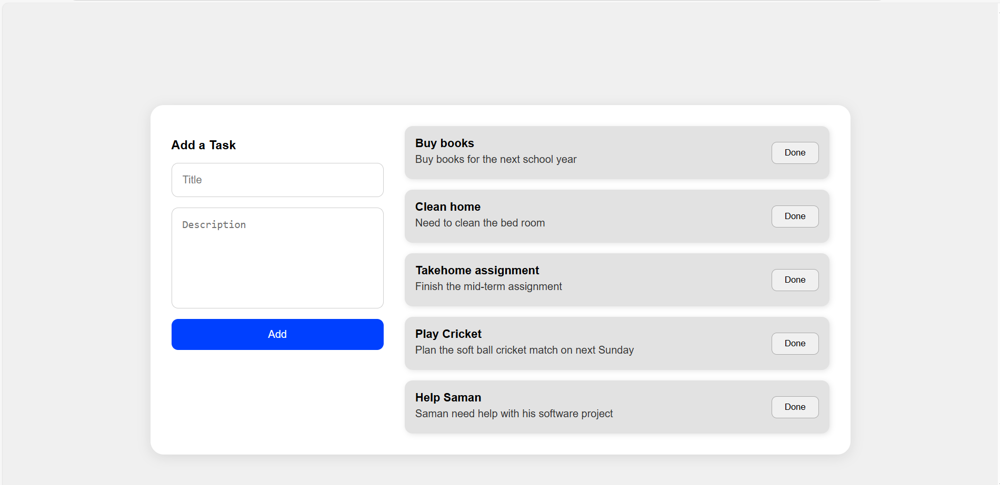

# 📝 Task Manager App

A simple full-stack task management application with:

- **Backend**: Spring Boot (Java)
- **Frontend**: React
- **Database**: PostgreSQL

---


---

task-app/ ├── backend/ # Spring Boot backend └── frontend/ # React frontend


---

## 🔧 Prerequisites

- Java 17+
- Node.js + npm
- PostgreSQL
- Maven

---

## 🗄️ Database Setup

1. Make sure PostgreSQL is running.
2. Create a database named `taskdb`:

```sql
CREATE DATABASE taskdb;
```
    Update your PostgreSQL username/password in backend/src/main/resources/application.properties:

spring.datasource.username=your_pg_username
spring.datasource.password=your_pg_password

🚀 How to Run the Application
1. Clone the Repository


2. Run the Backend

cd backend
./mvnw spring-boot:run

    The backend will be available at: http://localhost:8080

3. Run the Frontend

In a new terminal window:

cd frontend
npm install
npm start

    The frontend will be available at: http://localhost:3000

📋 API Endpoints

    GET /api/tasks - Get all tasks

    POST /api/tasks - Create a new task

🧪 Example Task JSON

{
  "title": "Buy groceries",
  "description": "Milk, Bread, Eggs"
}

📸 UI Overview


